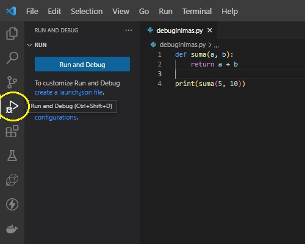
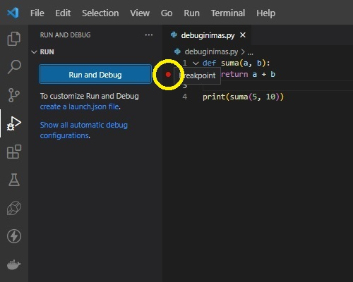
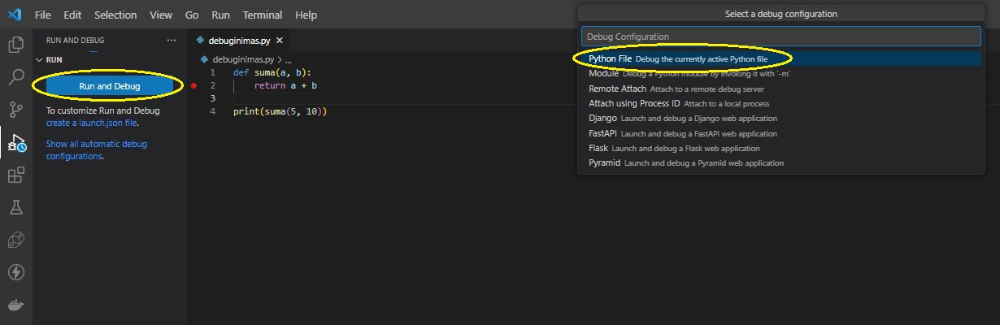
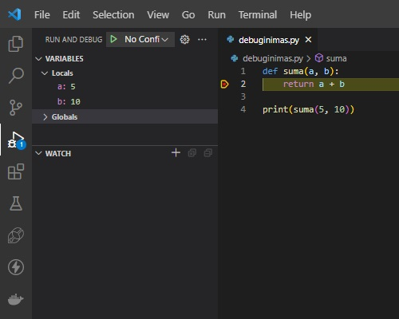

# Debuginimas

Debuginimas yra svarbi programavimo įgūdžių dalis, nes padeda programuotojams surasti ir ištaisyti klaidas savo kode.

## VS Code debuginimo įrankiai

VS Code turi įvairių įrankių, skirtų padėti programuotojams debuginimo procese, pvz "Run and Debug", kurį galite rasti CV Code kairiąjame meniu:



Debuginimui naudojami sustojimo taškai (angl. breakpoints), kurie leidžia sustabdyti programos vykdymą tam tikroje kodo vietoje, kad būtų galima tikrinti kintamųjų reikšmes, patikrinti programos būseną ar įvertinti kitus kodo elementus.



Breakpointo sukūrimui tiesiog pasirenkame eilutę, kurioje norime sustabdyti programos vykdymą, ir įjungiame breakpointą. Spaudžiame 'Run and Debug', pasirenkame Python faila.



Kai programa vykdoma, ji sustoja ties breakpointo eilute, leidžiant tirti kodo būseną ir kintamųjų reikšmes. Tada galime žingsnis po žingsnio vykdyti programą, stebėdami, kaip ji elgiasi.



## `print` naudojimas debuginimui (caveman debug)

`print` naudojimas debuginimui yra gana paprastas, tačiau veiksmingas būdas rasti klaidas kode. Tai dažnai vadinama "caveman debug", nes yra vienas iš seniausių ir paprasčiausių būdų, kaip rasti klaidas. Debuginimas daromas paprasčiausiai įterpiant `print()` komandas į kodą, kad būtų galima stebėti reikšmes tam tikrose vietose. Pvz.:

```Python
def suma(a, b):
    print("a:", a) # atspausdins reikšmę, kuri yra paduodama kaip argumentas a
    print("b:", b) # atspausdins reikšmę, kuri yra paduodama kaip argumentas b
    return a + b

rezultatas = suma(3, 5)
print("rezultatas:", rezultatas) # atspausdins sumos reikšmę
```

Rezultatas:

```Text
a: 3
b: 5
rezultatas: 8
```

## Užduotys
